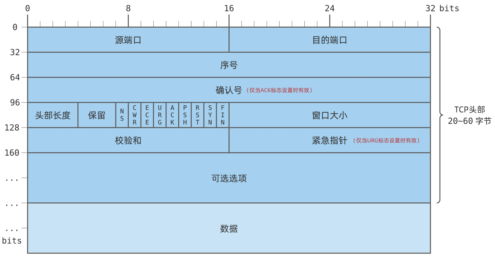

### TCP如何实现流量控制？

使用滑动窗口协议实现流量控制。防止发送方发送速率太快，接收方缓存区不够导致溢出。接收方会维护一个接收窗口，接受窗口的大小是根据自己的资源情况动态调整的，在返回ACK时将接受窗口大小放在TCP报文中的窗口字段告知发送方。发送窗口的大小不能超过接受窗口的大小，只有当发送方发送并收到确认之后，才能将发送窗口右移。

发送窗口的上限为接受窗口和拥塞窗口中的较小值。接受窗口表明了接收方的接收能力，拥塞窗口表明了网络的传送能力。

ACK -> Acknowledge number确认字符

### 什么是零窗口（接收窗口为0时会怎样）

如果接收方没有能力接收数据，就会将接收窗口设置为0，这时发送方必须暂停发送数据，但是会启动一个持续计时器(persistence timer)，到期后发送一个大小为1字节的探测数据包，以查看接收窗口状态。如果接收方能够接收数据，就会在返回的报文中更新接收窗口大小，恢复数据传送。

### TCP的拥塞控制是怎么实现的？

拥塞控制主要由四个算法组成：**慢开始（Slow Start）、拥塞避免（Congestion voidance）、快重传 （Fast Retransmit）、快恢复（Fast Recovery）**

1. 慢开始：刚开始发送数据时，先把拥塞窗口设置为一个较小的数值，每收到一个新的确认报文之后，就把拥塞窗口加倍。这样每经过一个传输轮次，拥塞窗口的大小就会加倍

2. 拥塞避免：当拥塞窗口的大小达到慢开始门限(slow start threshold)时，开始执行拥塞避免算法，拥塞窗口大小不再指数增加，而是线性增加，即每经过一个传输轮次只增加1。 

> 在不使用快重传的情况下，无论在慢开始阶段还是在拥塞避免阶段，只要发送方判断网络出现拥塞（其根据就是没有收到确认），就要把慢开始门限ssthresh设置为出现拥塞时的发送方窗口值的一半（但不能小于2）。然后把拥塞窗口cwnd重新设置为1，执行慢开始算法。

3. 快重传：快重传要求接收方在收到一个失序的报文段后就立即发出**重复确认**，而不要等到自己发送数据时捎带确认，为的是使发送方尽早知道有报文段没有到达对方。快重传算法规定，发送方只要一连收到三个重复确认就应当立即重传对方尚未收到的报文段，而不必继续等待设置的重传计时器时间到期。

4. 快恢复：发送方只要一连收到三个重复确认，就把慢开始门限减半，然后执行拥塞避免算法。

### TCP与UDP的区别

1. **TCP是面向连接的，UDP是无连接的。**TCP 发送数据前使用三次握手建立连接，UDP 发送数据前不需要建立连接。
2. **TCP是可靠的，UDP不可靠。**TCP丢包会自动重传，UDP 不会。TCP 可靠性由三个机制保证：1. 序号（TCP 报文的序号）2. 确认（ACK 机制）3. 重传（超时或者冗余的 ACK）
3. **TCP是面向字节流的，UDP是面向报文的。**
5. **TCP有拥塞控制机制，UDP没有。**网络出现的拥塞不会使源主机的发送速率降低，这对某些实时应用是很重要的，比如游戏，媒体通信，实时视频流直播。
5. **TCP有流量控制机制，UDP没有。**
6. **TCP首部开销（20字节）比UDP首部开销（8字节）要大**
7. **TCP有序，UDP无序。**

##### 什么时候选择TCP，什么时候选UDP？

某些对实时性要求比较高的应用，选择UDP，比如游戏，媒体通信，实时视频流直播，即使出现传输错误也可以容忍；其它大部分情况下，都是用TCP，因为传输的内容可靠，不出现丢失

##### HTTP可以使用UDP吗？

HTTP不可以使用UDP，HTTP需要基于可靠的传输协议，而UDP不可靠

### 什么是三次握手 (three-way handshake)？

- 第一次握手：客户端将同步序列号SYN置1，随机产生一个初始序列号seq发送给服务器，进入同步已发送(SYN_SENT)状态；
- 第二次握手：服务器收到客户端的SYN=1之后，知道客户端请求建立连接，将自己的同步序列号SYN置1，确认序列号ACK置1，产生一个acknowledge number = 初始序列号seq+1，并随机产生一个自己的初始序列号seq，发送给客户端；进入同步已接收(SYN_RCVD)状态；
- 第三次握手：客户端检查acknowledge number是否为初始序列号+1，ACK是否为1，检查正确之后将自己的确认序列号ACK置为1，产生一个acknowledge number=服务器发的序列号+1，发送给服务器；进入ESTABLISHED状态；服务器检查ACK为1和acknowledge number为序列号+1之后，也进入ESTABLISHED状态；完成三次握手，连接建立。

##### TCP建立连接可以两次握手吗？为什么?

不可以。有两个原因：

首先，可能会出现**已失效的连接请求报文段又传到了服务器端**。

其次，两次握手无法保证客户端正确接收第二次握手的报文（Server无法确认客户端是否收到），也无法保证客户端和服务器之间成功互换初始序列号。

##### 可以采用四次握手吗？为什么？

可以。但是会降低传输的效率。

四次握手是指：第二次握手：服务器只发送确认序列号ACK和acknowledge number；而服务器的同步序列号SYN和初始序列号seq在第三次握手时发送；原来协议中的第三次握手变为第四次握手。出于优化目的，四次握手中的二、三可以合并。

### 什么是四次挥手？

- 第一次挥手：客户端将连接终止位FIN置1，并发送一个序列号seq给服务器；进入终止等待1(FIN_WAIT_1)状态，等待服务端的确认；
- 第二次挥手：服务器收到客户端的FIN=1之后，发送一个确认序列号ACK=1，和acknowledge number=收到的序列号+1；进入关闭等待(CLOSE_WAIT)状态。此时客户端已经没有要发送的数据了，但仍可以接受服务器发来的数据。
- 第三次挥手：服务器将连接终止位FIN置1，发送一个序列号seq给客户端；进入最后确认(LAST_ACK)状态；
- 第四次挥手：客户端收到服务器的FIN=1之后，进入TIME_WAIT状态；接着将确认序列号ACK置1，发送一个acknowledge number=序列号+1给服务器；服务器收到后，确认acknowledge number后，变为CLOSED状态，不再向客户端发送数据。客户端等待2 * 报文段最长寿命(MSL)时间后，也进入CLOSED状态。完成四次挥手。

##### 为什么不能把服务器发送的ACK和FIN合并起来，变成三次挥手（CLOSE_WAIT状态意义是什么）？

因为服务器收到客户端断开连接的请求时，可能还有一些数据没有发完，这时先回复ACK，表示接收到了断开连接的请求。等到数据发完之后再发FIN，断开服务器到客户端的数据传送。

##### 如果第二次挥手时服务器的ACK没有送达客户端，会怎样？

客户端没有收到ACK确认，会重新发送FIN请求。

### HTTP请求有哪些常见状态码？

1. 2xx状态码：表示操作成功。200 OK
2. 3xx状态码：表示重定向
   + 301 永久重定向。表示请求的资源已经不存在了，需改用新的 URL 再次访问。
   + 302暂时重定向。表示请求的资源还在，但暂时需要用另一个 URL 来访问。
3. 4xx状态码：**表示客户端错误。**
   + 400 Bad Request：表示客户端请求的报文有错误，但只是个笼统的错误。
   + 401 Unauthorized：表示由于缺乏目标资源要求的身份验证凭证，发送的请求未得到满足。
   + 403 Forbidden：表示服务器禁止访问资源。
   + 404 Not Found：表示请求的资源在服务器上不存在或未找到。
4. 5xx状态码：**表示服务器错误。**
   + 500：表示服务器发生了错误，但只是个笼统的错误。
   + 501：客户端请求的功能还不支持。
   + 502：通常是服务器作为网关或代理时返回的错误码，表示服务器自身工作正常，访问后端服务器发生了错误。
   + 503：表示服务器当前很忙，暂时无法响应客户端。

### GET与POST的区别？

1. GET请求用于从服务器获取资源，是一种幂等的操作，不会对服务器产生任何副作用。POST请求用于向服务器提交数据，可能会对服务器产生副作用，如创建、更新或删除资源。
3. GET请求的数据附在URL之后，在HTTP请求头中，以键值对的形式出现在URL的末尾，对 URL 的长度有限制；POST请求的数据在请求体中，没有大小限制。
4. GET请求可以被浏览器缓存，安全性较低。POST请求默认不会被缓存，每次请求都会向服务器发送数据，安全性较高。
5. GET只允许ASCII字符，POST对数据类型没有要求；
6. 使用场景：GET适合获取资源、获取数据，如查看网页、搜索等操作。POST适合提交数据、修改数据，如提交表单、上传文件等操作。

### Session与Cookie的区别？

Cookie：Cookie是客户端保存用户信息的一种机制，将服务器发送到浏览器的数据保存在本地，下次向同一服务器再发起请求时被携带发送。

Session：Session是服务器跟踪用户状态的一种机制。

Session与Cookie的区别：

+ Cookie保存在客户端，Session保存在服务器端，可以通过检索Sessionid查看状态。
+ Cookie只能保存 ASCII，Session可以存任意数据类型
+ Cookie中的信息容易被删除修改，Session安全性较高。
+ Cookie的存储容量受到浏览器的限制，Session在服务器端存储数据，存储容量通常较大。

### Token令牌

+ 客户端将用户的账号和密码提交给服务器
+ 服务器对其进行校验，通过则生成一个 token 值返回给客户端，作为后续的请求交互身份令牌
+ 客户端拿到服务端返回的 token 值后，可将其保存在本地，以后每次请求服务器时都携带该 token，提交给服务器进行身份校验
+ 服务器接收到请求后，从请求中提取令牌，并对其进行验证和解析。验证包括检查令牌的签名、有效期和其他相关属性，以确保令牌的合法性和有效性。
+ 验证通过之后，服务端就可以根据该 Token 中的 uid 获取对应的用户信息，进行业务请求的响应

###  JSON Web Token（JWT）

+ **Header 头部信息**：记录了使用的加密算法信息
+ **Payload 净荷信息**：记录了用户信息和过期时间等信息
+ **Signature 签名信息**：根据 header 中的加密算法和 payload 中的用户信息以及密钥 key 来生成，是服务端验证的重要依据

### 从输入网址到获得页面的过程

1. 浏览器进行DNS解析，获取域名对应的IP地址。具体过程包括浏览器搜索⾃身的DNS缓存、搜索操作系统的DNS缓存、读取本地的Host⽂件和向本地DNS服务器进⾏查询等。
2. 浏览器获得域名对应的IP地址以后，浏览器向服务器发起三次握手，请求建立TCP连接
3. TCP/IP连接建立起来后，浏览器向服务器发送HTTP请求
4. 服务器接收到这个请求，并根据路径参数映射到特定的请求处理器进行处理，并将生成的HTTP响应发送回浏览器
5. 浏览器接收到HTTP响应后，根据响应中的内容解析和渲染页面

### DNS

因特网采用树状的域名结构。域名的结构由若干个分量组成，各分量之间用“点”隔开，分别代表不同级别的域名。

DNS域名服务器分为根域名服务器、顶级域名服务器、权威域名服务器和本地域名服务器。

- 根域名服务器（.）
- 顶级域名服务器（.com）
- 权威域名服务器（google.com）

### DNS解析过程

+ 客户端向本地域名服务器发送DNS解析请求

+ 本地域名服务器查询根域名服务器，获取顶级域名服务器的IP地址

+ 本地域名服务器查询顶级域名服务器，获取权威域名服务器的IP地址

+ 本地域名服务器查询权威域名服务器，获取目标域名的IP地址

+ 本地域名服务器将 IP 地址返回客户端，客户端和目标建立连接。

  

  

### TCP报文段首部格式

1字节 = 8比特

+ **源端口**：占16比特，写入源端口号，用来标识发送该TCP报文段的应用进程。
+ 目的端口：占16比特，写入目的端口号，用来标识接收该TCP报文段的应用进程。
+ **序号(*sequence number*)**：占32比特，取值范围[0, 2^32-1]，序号增加到最后一个后，下一个序号就又回到0。指出本TCP报文段数据载荷的第一个字节的序号。
+ **确认号(*acknowledgement number*)**：占32比特，取值范围[0, 2^32-1]，序号增加到最后一个后，下一个序号就又回到0。
  + 指出期望收到对方下一个TCP报文段的数据载荷的第一个字节的序号，同时也是对之前收到的所有数据的确认。
  + 若确认号 = n，则表明到序号n-1为止的所有数据都己正确接收，期望接收序号为n的数据。

+ **头部长度**：占4比特，并以4字节为单位。用来指出TCP报文段的数据载荷部分的起始处距离TCP报文段的起始处有多远。这个字段实际上是指出了TCP报文段的首部长度。
  + 首部固定长度为20字节，因此数据偏移字段的最小值为(0101)2
  + 首部最大长度为60字节，因此数据偏移字段的最大值为(1111)2
+ **保留**：保留未用。
+ **确认序列号ACK**：确认指令，表示确认号有效，对已接收数据进行确认；取值为1时确认号字段才有效;取值为0时确认号字段无效。
+ **同步序列号SYN**：在TCP三次握手建立连接时的序号同步指令。
+ **连接终止位FIN**：用来释放TCP连接。
+ **复位标志位RST**：用来复位TCP连接。
  + 当RST=1时，表明TCP连接出现了异常，必须释放连接，然后再重新建立连接。
  + RST置1还用来拒绝一个非法的报文段或拒绝打开。
+ **推送标志位PSH**：接收方的TCP收到该标志位为1的报文段会尽快上交应用进程，而不必等到按收缓存都填满后再向上交付。
+ **紧急标志位URG**：取值为1时紧急指针字段有效：取值为0时紧急指针字段无效。
+ **紧急指针**：占16比特，以字节为单位，用来指明紧急数据的长度。
  + 当发送方有紧急数据时，可将紧急数据插队到发送缓存的最前面，并立刻封装到一个TCP报文段中进行发送。紧急指针会指出本报文段数据载荷部分包含了多长的紧急数据，紧急数据之后是普通数据。
+ **窗口字段**：占16比特，表示当前报文发送者接收窗口的大小，单位一般是字节。用于实现流量控制机制。
+ **校验和**：占16比特，校验范国包括TCP报文段的首部和数据载荷两部分。

+ **可选选项**：
  + 最大报文段长度MSS选项：TCP报文段数据载荷部分的最大长度。
  + 窗口扩大选项：为了扩大窗口（提高吞吐率）。
  + 时间戳选项：用来计算往返时间RTT
+ **填充**：由于选项的长度可变，因此使用填充来确保报文段首部能被4整除

